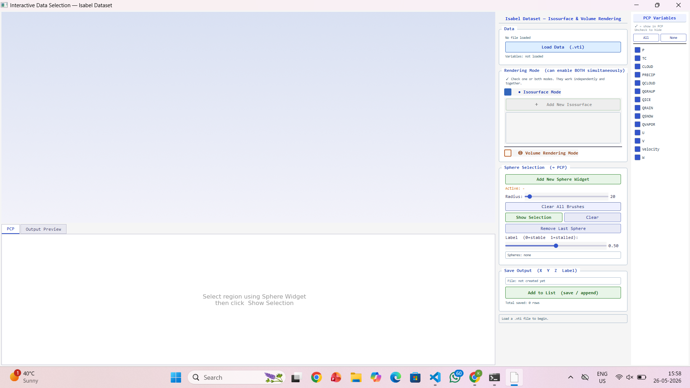
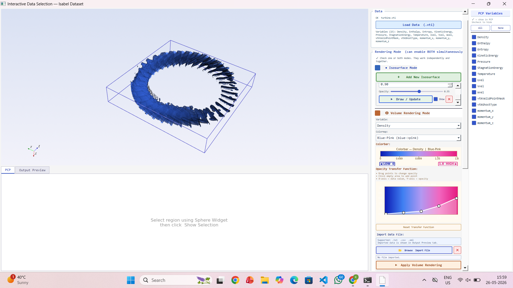
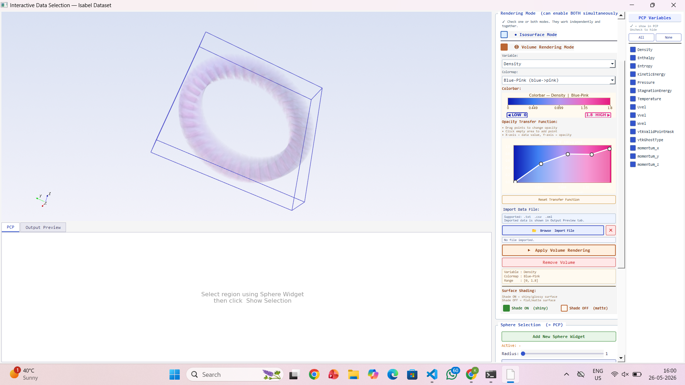
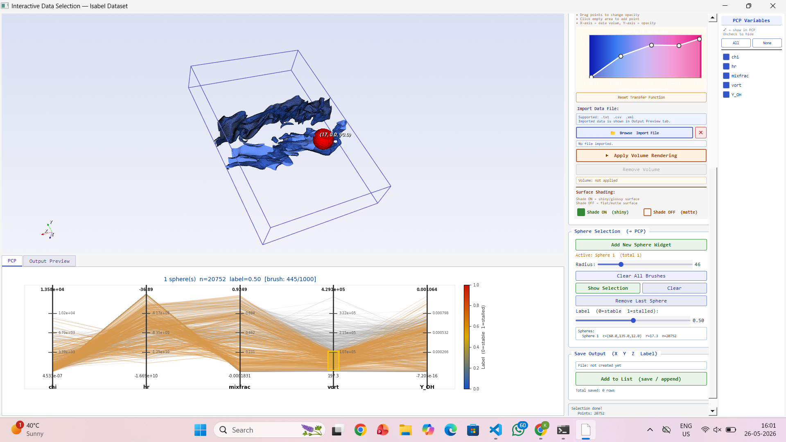

# Interactive Selection of Training Data for 3D Volumetric Datasets

<p align="center">
  An interactive desktop tool for loading volumetric `.vti` data, exploring it in 3D, selecting labeled regions of interest, and exporting training data for machine learning workflows.
</p>

<p align="center">
  
  
  
  
</p>

<p align="center">
  
</p>

<p align="center">
  <a href="#guided-demo-walkthrough">Demo Walkthrough</a> •
  <a href="#features">Features</a> •
  <a href="#requirements">Requirements</a> •
  <a href="#running-the-project">Run Project</a>
</p>

## Project Overview

Researchers often spend a large amount of time manually sifting through 3D volumetric datasets to identify meaningful regions for analysis and model training. This project was designed to reduce that effort through an interactive training data selection tool that supports end-to-end exploration, filtering, selection, and export of labeled data.

The system was developed collaboratively by understanding research needs, iterating on the interface based on feedback, and delivering a working prototype that significantly reduces manual data selection effort.

Built using **Python, VTK, PyQt5, Matplotlib, and NumPy**, the tool combines:

- interactive **isosurface rendering**
- real-time **volume rendering**
- **sphere widget**-based region selection
- **parallel coordinates plots (PCP)** for multivariate inspection
- **brushing and filtering** for fine-grained sample refinement
- labeled output generation for downstream **machine learning training**

## Why This Project Matters

- Identified a core user pain point: manual filtering of large 3D volumetric datasets for training data creation.
- Designed and developed an interactive labeled data selection workflow to solve the problem end-to-end.
- Collaborated on requirements, refined the interface through feedback, and delivered a usable research prototype.
- Enabled intuitive 3D filtering with sphere widgets, isosurface rendering, and volume rendering in one interface.
- Supported real-time visual exploration and export of labeled samples for ML model training.

## At a Glance

| Stage | What the user does | What the tool enables |
| --- | --- | --- |
| **1. Load Data** | Open any supported `.vti` dataset | Reads volumetric data and available variables dynamically |
| **2. Explore in 3D** | Turn on isosurface mode, volume rendering mode, or both | Real-time structural and volumetric inspection |
| **3. Select Region** | Place sphere widgets in the 3D view | Region-focused spatial filtering for training samples |
| **4. Refine in PCP** | Send selected points to the PCP and brush variables | Multivariate filtering before export |
| **5. Label and Save** | Assign a label and export data | Creates ML-ready `X Y Z Label` output |

## Features

| Feature | Description |
| --- | --- |
| **Load volumetric datasets** | Open `.vti` files and inspect available scalar variables dynamically |
| **Isosurface mode** | Generate and manage one or more isosurfaces with variable and opacity controls |
| **Volume rendering mode** | Visualize internal structures using transfer functions and colormap controls |
| **Combined rendering** | Run isosurface mode, volume mode, or both together in the same session |
| **Sphere widget selection** | Select spatial regions of interest directly inside the 3D view |
| **PCP visualization** | Inspect selected points across multiple variables using a parallel coordinates plot |
| **Brushing support** | Refine the selected subset interactively before export |
| **Labeled export** | Save selected samples in `X Y Z Label` format for ML pipelines |

## Workflow

This tool supports a simple research workflow:

```text
Load any .vti dataset
      ->
Enable Isosurface Mode, Volume Rendering Mode, or both
      ->
Explore the 3D data in real time
      ->
Add sphere widgets to select regions of interest
      ->
Show selected points in the PCP panel
      ->
Brush/filter the PCP to refine the subset
      ->
Assign a label value
      ->
Save the selected data for model training
```

## Guided Demo Walkthrough

### 1. Full Interface

The main workspace brings together the 3D viewport, rendering controls, PCP variable controls, sphere selection tools, and export panel in one place.

<p align="center">
  
</p>

### 2. Isosurface Mode

After loading data, users can enable isosurface mode to reveal structural patterns and inspect extracted surfaces interactively.

<p align="center">
  
</p>

### 3. Volume Rendering Mode

Volume rendering can be enabled independently, or together with isosurfaces, to expose internal volumetric patterns using transfer-function-based opacity and color controls.

<p align="center">
  
</p>

### 4. Sphere Selection + PCP + Brushing

Once a meaningful region is identified, sphere widgets can be used to select localized data points. These points are then pushed to the PCP view for variable-wise inspection and brushing-based refinement before labeling and export.

<p align="center">
  
</p>

<details>
  <summary><strong>What makes the interaction useful?</strong></summary>

  <br>

  - Any `.vti` dataset can be loaded into the interface.
  - Isosurface mode and volume rendering mode can be used independently or together.
  - Sphere widgets provide intuitive spatial selection directly inside the 3D scene.
  - PCP and brushing make it easier to refine selected samples before saving them for model training.
</details>

## Technologies Used

- Python
- VTK
- PyQt5
- Matplotlib
- NumPy

No separate JavaScript or HTML/CSS runtime is required for this desktop application.

## Requirements

### Software Requirements

- Python 3.8 or above
- Python 3.10 recommended
- VTK 9.x
- PyQt5 5.15+
- NumPy 1.21+
- Matplotlib 3.5+

### System Configuration

- Operating System: Windows 10/11
- RAM: Minimum 4 GB
- Processor: Intel i3 or above
- Disk Space: 500 MB free space

### Python Libraries Installation

```bash
pip install vtk pyqt5 numpy matplotlib
```

Or install directly from the project requirements file:

```bash
pip install -r requirements.txt
```

## Running the Project

### Standard Run

```bash
python vtk_final.py
```

### Jupyter Notebook Run

```python
%gui qt5
%run vtk_final.py
```

## Output Format

The selected and labeled output is stored in the following format:

```text
X  Y  Z  Label
```

This makes the exported data suitable for:

- supervised learning pipelines
- scientific classification workflows
- curated training data generation
- feature-driven model experimentation

## Project Structure

```text
.
|-- vtk_final.py
|-- interface for interactive data selection.ipynb
|-- requirements.txt
|-- assets/
|   `-- screenshots/
|-- LICENSE
`-- README.md
```

## Academic Context

This project was developed as an interactive research-oriented prototype for efficient selection of labeled training data from volumetric scientific datasets.

## Acknowledgement

This project was developed under the guidance of **Dr. Soumya Dutta**, Assistant Professor, Department of Computer Science and Engineering, IIT Kanpur.

## Author

**Kritika Gupta**  
B.Tech CSE (Data Science)

## License

This project is licensed under the **MIT License**.
